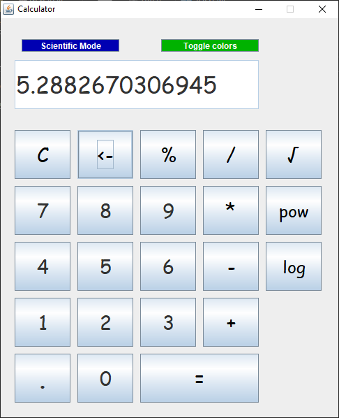
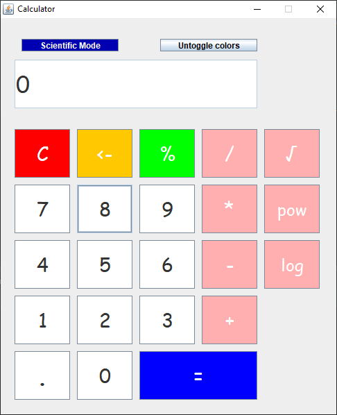

# Calculator App

Very basic calculator application created by Java **Swing**. 

## Thank You!
Please ⭐️ this repo and share it with others

### Screenshots
Sample           |   Colored
:---------------------:|:-----------------
 | 

### Requirements 🔧
* Java version 8 or higher.

### Installation 🔌
1. Press the **Fork** button (top right the page) to save copy of this project on your account.

2. Download the repository files (project) from the download section or clone this project by typing in the bash the following command:

       git clone https://github.com/HouariZegai/Calculator.git
3. Imported it in Intellij IDEA or any other Java IDE.
4. Run the application :D

### Contributing 💡
If you want to contribute to this project and make it better with new ideas, your pull request is very welcomed.
If you find any issue just put it in the repository issue section, thank you.
