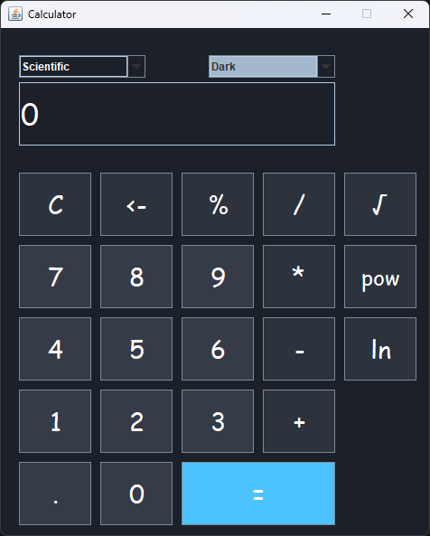

# Calculator
A very basic calculator application created using Java **Swing**. 

## Thank You!
Please ⭐️ this repo and share it with others

## Screenshots
|                Scientific / Dark                | Standard / Colored |
:------------------------------------------------:|:-------------------|
  | 

## Requirements 🔧
* Java 11 or higher.
* The latest version of the Java Developer Kit can be downloaded here: https://www.oracle.com/java/technologies/downloads/
  
## Installation 🔌
1. Press the **Fork** button (top right the page) to save copy of this project on your account.

2. Download the repository files (project) from the download section or clone this project by typing in the bash the following command:

       git clone https://github.com/HouariZegai/Calculator.git
3. Imported it in Intellij IDEA or any other Java IDE.
   * Intelij can be downloaded here: https://www.jetbrains.com/idea/
5. Build and run the application :D

## Directory Guide
| Directory                                 | Contents                                                                    |
| -------------                             |:-------------:                                                              |
| screenshots                               | contains example images of running program in light and dark mode           |
| src/main/resources                        | contains light and dark theme specifications                                |
| src/main/java/com.houarizegai.calculator  | contains bulk of code, including App.java (main function), theme directory (containing all theme helper functions), ui directory (containing all ui component initilizations, calculation functions, and CalculatorUI function to initalize entire UI) and the util directory (contains coloring specifications)                                                                                                           |
| src/test                                  | contains testing functions                                                  |

## Functionality Outline:
* program calls a new instance of the CalculatorUI class, during initilization:
  * theme is loaded
  * window size is determined
  * components visible to user (like buttons are initilized)
 * while program is running, initButtons() will listen for user interaction and call the calculate() function when necessary
## Testing
 * testing function implemented to ensure calculate functionality acts as expected
 * test cases may be expanded upon

 ### Current Test Cases:
| Operation               | Test Details               |
| -------------           |:-------------:             |
| addition                | assert 5 + 3 = 8           |
| subtraction             | assert 2 - 8 = -6          |
| multiplication          | assert 44.5 * 10 = 445     |
| modulo                  | assert 3 % 5 = 3           |
| exponent                | assert 5 ^ 3 = 125         |

## Contributing 💡
If you want to contribute to this project and make it better with new ideas, your pull request is very welcomed.
If you find any issue just put it in the repository issue section, thank you.
